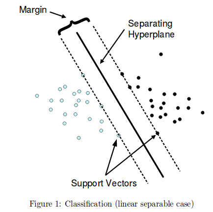

This is an R Markdown document. Markdown is a simple formatting syntax for authoring HTML, PDF, and MS Word documents. For more details on using R Markdown see <http://rmarkdown.rstudio.com>.

When you click the **Knit** button a document will be generated that includes both content as well as the output of any embedded R code chunks within the document. You can embed an R code chunk like this:


# Introduction

In this section, we are describing the data used for this tutorial. We consider the Pokedex data (https://github.com/veekun/pokedex), and try to solve the following question: how different are fire and water pokemon ? could a computer learn to identify the two types? 

# Data description

Raw data were already processed to save time. We randomly split data in two sets (*train.df* and *val.df*) that cover respectively 80% and 20% of the data. 

```{r}
load('../data/processed_data_water_fire.Rdata')
```

Here is an interactive table of the training set. Feel free to sort the columns, and filter the rows to explore the dataset.

```{r}
if(!require('DT')) install.packages('DT',repos='http://mirror.las.iastate.edu/CRAN/')

DT::datatable(train.df,rownames= FALSE)
```

where:

* id: a pokemon unique ID
* height: pokemon height
* weight: pokemon weight
* base_experience: experience granted if defeated
* type_1: pokemon type (can be multiple, if so, duplicate entries)
* attack, defense: characteristics regardin 'physicial' traits
* hp: health points
* special_attack, special_defense: characteristics regarding 'non-physical' traits
* speed: pokemon speed
* egg_group_1: pokemons from the same group (but different species) can have babies
* color_id: pokemon principal color
* shape_id: pokemon shape category
* gender_rate: pokemon gender rate (-1 genderless, 0 is male only, 8 is female only)
* capture_rate: how easy it is to catch a pokemon (0 is hard, 255 is easy)
* base_happiness: how happy is a pokemon after catch (0 unhappy to 140 happy)
* is_baby: does this pokemon only exist as a baby form of other pokemons ?
* hatch_counter:  how long it takes to hatch an egg (5 quick to 120 long)
* has_gender_differences: is there differences between male and female in their development?
* growth_rate_id: how fast a pokemon level up (from 1 fast to 6 slow)
* evolution: TRUE if the pokemon has evolved from another pokemon

# Univariate analysis

In this section, we want to identify the best variable along which the fire/water pokemon are well-separated by a **linear** rule: **is the value greater or lower than a threshold ?**

### Model 'training'

* Please select your variable using the menu and then define a threshold value to separate the data in two parts.

* This threshold is represented by the red dashed line. And on each side of the line, we put the name of the majority class.

* We update the accuracy of the split you define. The accuracy is computed as the number of pokemon correctly classified divided by the total number of pokemon (0% is not accurate, 100% is perfect).

* Please note that the *y*-axis value has no meaning here, it simply helps to visualize all the points that could overlap.

```{r echo = FALSE}
selectInput("variable", label = "Choose the variable:",
              choices = colnames(train.df)[-5], selected = 'height')

```


```{r echo = FALSE}
renderPlot({
  set.seed(42)
  plot(train.df[,input$variable],jitter(rep(0,nrow(train.df)),1), col=ifelse(test = train.df$type_1 == 'water',yes = 'blue',no = 'orange'), pch=16,ylim= c(-0.01,0.01),
       ylab='',xlab=input$variable,yaxt='n')
  grid()
  abline(v=input$axis,lty=2,lwd=2,col='red')
  legend(x = 'topright',legend = c('water','fire'),pch=c(16,16),col = c('blue','orange'))
  # find majority class on each side
  tmp.left = sum(train.df[which(train.df$type_1=='fire'),input$variable]>input$axis)/nrow(train.df[which(train.df$type_1=='fire'),])
  tmp.right = sum(train.df[which(train.df$type_1=='fire'),input$variable]<input$axis)/nrow(train.df[which(train.df$type_1=='fire'),])
   
  if(tmp.left>tmp.right){
    text('Majority of Fire type', x=input$axis*1.6,y=0.009,col='orange')
        text('Majority of Water type', x=input$axis*0.4,y=0.009,col='blue')
  }else{
     text('Majority of Fire type', x=input$axis*0.4,y=0.009,col='orange')
            text('Majority of Water type', x=input$axis*1.6,y=0.009,col='blue')
  }
  
},width=800)


renderUI({
        sliderInput("axis", min = min(train.df[,input$variable]), max = max(train.df[,input$variable]), value = mean(train.df[,input$variable]),label='threshold',width=800)
})

renderText({ 
    paste("Your accuracy on the training data is currently:",round(max(sum((train.df[,input$variable] > input$axis) == (train.df$type_1 == 'water')),  sum((train.df[,input$variable] > input$axis) == (train.df$type_1 == 'fire')))/nrow(train.df),2),'\n')
  })

# 0.86 for egg_group
# thresh = 9
```

* What is the best accuracy you obtained ? 

* Which variable is used ?

### Model validation

* In the previous step, we focused on improving the accuracy of the model on the training data. 

* Usually, the goal of a decision rule is to generalize well to unobserved data. 

* It is the reason why we held some data out of the training data, called the validation data (*val.df*).

* For the same threshold you defined as optimal, here is the accuracy on the validation data:

```{r,echo=F}
renderText({ 
    paste("Your accuracy on the validation data is currently:",round(max(sum((val.df[,input$variable] > input$axis) == (val.df$type_1 == 'water')),  sum((val.df[,input$variable] > input$axis) == (val.df$type_1 == 'fire')))/nrow(val.df),2),'\n')
  })

# 0.88 for egg_group
# thresh = 9
```

* If the validation accuracy is similar to the training accuracy, then we can conclude that our model will properly generalize to new data. If it is not the case, we might be in a case of **overfitting**.

* Could we improve our current model by combining two variables instead of one ?

# Bivariate Linear analysis


### Model 'training'

* By selecting two variables, we can now represent the data in two dimensions.

* Our decision rule needs to separate the two groups in the plane created by the two dimensions.

* Here, the separation is again **linear**, and this time it will be represented as a line, and not a single threshold value.

```{r echo=FALSE}
selectInput("x", "Choose variable 1:", colnames(train.df)[-5], selected = 'height')
selectInput("y", "Choose variable2 :", colnames(train.df)[-5], selected = 'speed')


renderPlot({

  plot(train.df[,input$x],train.df[,input$y], col=ifelse(test = train.df$type_1 == 'water',yes = 'blue',no = 'orange'), pch=16,
       ylab=input$y,xlab=input$x)
  grid()
   legend(x = 'topright',legend = c('water','fire'),pch=c(16,16),col = c('blue','orange'))
    abline(a=input$intercept,b = input$slope,col='red',lty=2,lwd=2)
  
    # get top/bot majority class
  nb.fire.above = sum(input$slope*train.df[which(train.df$type_1=='fire'),input$x] + input$intercept < train.df[which(train.df$type_1=='fire'),input$y])/nrow(train.df[which(train.df$type_1=='fire'),])
  nb.fire.below = sum(input$slope*train.df[which(train.df$type_1=='fire'),input$x] + input$intercept >= train.df[which(train.df$type_1=='fire'),input$y])/nrow(train.df[which(train.df$type_1=='fire'),])
  if(nb.fire.above > nb.fire.below){
      text('Majority of Fire type', x=0.5*(max(train.df[,input$x])-min(train.df[,input$x])), y = max(train.df[,input$y]),col='orange')
        text('Majority of Water type', x=0.5*(max(train.df[,input$x])-min(train.df[,input$x])), y = min(train.df[,input$y]),col='blue')
  }else{
          text('Majority of Fire type', x=0.5*(max(train.df[,input$x])-min(train.df[,input$x])), y = min(train.df[,input$y]),col='orange')
        text('Majority of Water type', x=0.5*(max(train.df[,input$x])-min(train.df[,input$x])), y = max(train.df[,input$y]),col='blue')
  }
  
  })

renderUI({
  sliderInput('slope','Slope',min=-2,value=0,max=2,step=0.05)
})

renderUI({
  sliderInput('intercept','Intercept',min=0, max = 2*max(train.df[,input$y]),value=mean(train.df[,input$y]),step=0.1)
})

renderText({
  nb.fire.above = sum(input$slope*train.df[which(train.df$type_1=='fire'),input$x] + input$intercept < train.df[which(train.df$type_1=='fire'),input$y])/nrow(train.df[which(train.df$type_1=='fire'),])
  nb.fire.below = sum(input$slope*train.df[which(train.df$type_1=='fire'),input$x] + input$intercept >= train.df[which(train.df$type_1=='fire'),input$y])/nrow(train.df[which(train.df$type_1=='fire'),])
  if(nb.fire.above > nb.fire.below){
    acc = sum(c(input$slope*train.df[which(train.df$type_1=='fire'),input$x] + input$intercept < train.df[which(train.df$type_1=='fire'),input$y],
                input$slope*train.df[which(train.df$type_1=='water'),input$x] + input$intercept > train.df[which(train.df$type_1=='water'),input$y]))/nrow(train.df)
    
  }else{
    acc = sum(c(input$slope*train.df[which(train.df$type_1=='fire'),input$x] + input$intercept > train.df[which(train.df$type_1=='fire'),input$y],
                input$slope*train.df[which(train.df$type_1=='water'),input$x] + input$intercept < train.df[which(train.df$type_1=='water'),input$y]))/nrow(train.df)
  }

  paste('Accuracy on train set:',round(acc,2))
})
# 0.88 for colorID and egg_group
# slope= 0.45
# intercept = 7.9
```


### Model validation

* In the previous step, we focused on improving the accuracy of the model on the training data. 

* Usually, the goal of a decision rule is to generalize well to unobserved data. 

* It is the reason why we held some data out of the training data, called the validation data (*val.df*).

* For the same line you defined as optimal, here is the accuracy on the validation data:

```{r,echo=F}
renderText({ 
  
  nb.fire.above = sum(input$slope*train.df[which(train.df$type_1=='fire'),input$x] + input$intercept < train.df[which(train.df$type_1=='fire'),input$y])/nrow(train.df[which(train.df$type_1=='fire'),])
  nb.fire.below = sum(input$slope*train.df[which(train.df$type_1=='fire'),input$x] + input$intercept >= train.df[which(train.df$type_1=='fire'),input$y])/nrow(train.df[which(train.df$type_1=='fire'),])
  if(nb.fire.above > nb.fire.below){
    acc.val = sum(c(input$slope*val.df[which(val.df$type_1=='fire'),input$x] + input$intercept < val.df[which(val.df$type_1=='fire'),input$y],
                input$slope*val.df[which(val.df$type_1=='water'),input$x] + input$intercept > val.df[which(val.df$type_1=='water'),input$y]))/nrow(val.df)
    
  }else{
    acc.val = sum(c(input$slope*val.df[which(val.df$type_1=='fire'),input$x] + input$intercept > val.df[which(val.df$type_1=='fire'),input$y],
                input$slope*val.df[which(val.df$type_1=='water'),input$x] + input$intercept < val.df[which(val.df$type_1=='water'),input$y]))/nrow(val.df)
  }
  
  
  
    paste("Your accuracy on the validation data is currently:",round(acc.val,2),'\n')
  })

# 0.91 for colorID and egg_group
# slope= 0.45
# intercept = 7.9
```

* If the validation accuracy is similar to the training accuracy, then we can conclude that our model will properly generalize to new data. If it is not the case, we might be in a case of **overfitting**.

* **NB**: this kind of linear separation is at the core of many machine learning algorithms, such as **support vector machines**.

    


* As you may have noticed, the number of combinations is too large for you to test everything.

* How difficult this task will be if we include more than 2 dimensions in the model?

```{r echo=FALSE}
    if(!require(LiblineaR)) install.packages('LiblineaR',repos='http://mirror.las.iastate.edu/CRAN/')
```

```{r}
# SVM trained on all dimensions
fit <- LiblineaR(target=train.df$type_1,data = train.df[,-5])

# weights found by the optimization algorithm
round(fit$W,2)
```

* What are the most important features found by the model ?

* Do they correspond to the ones you identified ? If not, try them in the previous task.

* The sign of the weights represents how they are associated with the two classes (positive: fire, negative: water).

```{r}
#accuracy on training data
sum(predict(fit,newx = train.df[,-5])$predictions == train.df$type_1)/nrow(train.df)

#accuracy on validation data
sum(predict(fit,newx = val.df[,-5])$predictions == val.df$type_1)/nrow(val.df)

```


```{r, echo=F}

#cost = 0.1


#fit <- reactive({LiblineaR(target = train.df$type_1,data=cbind(train.df[,input$x],train.df[,input$y]),bias = TRUE,cost=input$cost)$W})

# renderPlot({
#   
#   fit <- LiblineaR(target = train.df$type_1,data=cbind(train.df[,input$x],train.df[,input$y]),bias = TRUE,cost=input$slope)$W
#   
#   
#   plot(train.df[,input$x],train.df[,input$y], col=ifelse(test = train.df$type_1 == 'water',yes = 'blue',no = 'orange'), pch=16,
#        ylab=input$y,xlab=input$x)
#   grid()
#   legend(x = 'topright',legend = c('water','fire'),pch=c(16,16),col = c('blue','orange'))
#   
#     
#   slope = -fit[,'W1']/fit[,'W2']
#   intercept = -fit[,'Bias']
#   
#   abline(a=intercept, b=slope, col="blue", lty=3)
# 
# 
#   # get top/bot majority class
#   nb.fire.above = sum(slope*train.df[which(train.df$type_1=='fire'),input$x] + intercept < train.df[which(train.df$type_1=='fire'),input$y])/nrow(train.df[which(train.df$type_1=='fire'),])
#   nb.fire.below = sum(slope*train.df[which(train.df$type_1=='fire'),input$x] + intercept >= train.df[which(train.df$type_1=='fire'),input$y])/nrow(train.df[which(train.df$type_1=='fire'),])
#   if(nb.fire.above > nb.fire.below){
#     text('Majority of Fire type', x=0.5*(max(train.df[,input$x])-min(train.df[,input$x])), y = max(train.df[,input$y]),col='orange')
#     text('Majority of Water type', x=0.5*(max(train.df[,input$x])-min(train.df[,input$x])), y = min(train.df[,input$y]),col='blue')
#   }else{
#     text('Majority of Fire type', x=0.5*(max(train.df[,input$x])-min(train.df[,input$x])), y = min(train.df[,input$y]),col='orange')
#     text('Majority of Water type', x=0.5*(max(train.df[,input$x])-min(train.df[,input$x])), y = max(train.df[,input$y]),col='blue')
#   }
#   
# })
# 
#renderUI({
#  sliderInput('cost','Error cost',min=10^-6,value=1,max=10,step=0.01)
#})


# renderText({

#   
#   slope = -fit()[,'W1']/fit()[,'W2']
#   intercept = -fit()[,'Bias']
#   
#   nb.fire.above = sum(slope*train.df[which(train.df$type_1=='fire'),input$x] + intercept < train.df[which(train.df$type_1=='fire'),input$y])/nrow(train.df[which(train.df$type_1=='fire'),])
#   nb.fire.below = sum(slope*train.df[which(train.df$type_1=='fire'),input$x] + intercept >= train.df[which(train.df$type_1=='fire'),input$y])/nrow(train.df[which(train.df$type_1=='fire'),])
#   if(nb.fire.above > nb.fire.below){
#     acc = sum(c(slope*train.df[which(train.df$type_1=='fire'),input$x] + intercept < train.df[which(train.df$type_1=='fire'),input$y],
#                 slope*train.df[which(train.df$type_1=='water'),input$x] + intercept > train.df[which(train.df$type_1=='water'),input$y]))/nrow(train.df)
#     
#   }else{
#     acc = sum(c(slope*train.df[which(train.df$type_1=='fire'),input$x] + intercept > train.df[which(train.df$type_1=='fire'),input$y],
#                 slope*train.df[which(train.df$type_1=='water'),input$x] + intercept < train.df[which(train.df$type_1=='water'),input$y]))/nrow(train.df)
#   }
#   
#   paste('Accuracy on train set:',round(acc,2))
# })


```


# Bivariate non-linear analysis

* In real world data, it is rare that a linear decision rule is a perfect separator for the two classes (see previous task).  

* Non-linear approaches have been proposed to define more complex decision rules.

* One example is the **decision tree**, where a sequence of linear splits is used to partition the data.

### Decision tree training

* By selecting two variables, we can now represent the data in two dimensions.

* Our decision rule needs to separate the two groups in the plane created by the two dimensions.

* Here, we explore another way to define decision rule, by using a decision tree structure (**non-linear**).

```{r echo=FALSE}

 selectInput("x.nl", "Choose variable 1:", colnames(train.df)[-5], selected = 'height')
 selectInput("y.nl", "Choose variable 2:", colnames(train.df)[-5], selected = 'speed')


 renderPlot({
   
   plot(train.df[,input$x.nl],train.df[,input$y.nl], col=ifelse(test = train.df$type_1 == 'water',yes = 'blue',no = 'orange'), pch=16,
        ylab=input$y.nl,xlab=input$x.nl)
   grid()
   legend(x = 'topright',legend = c('water','fire'),pch=c(16,16),col = c('blue','orange'))
  # if(input$select.nl == input$x.nl) abline(v=input$cur.thresh,col='red')
  # if(input$select.nl == input$y.nl) abline(v=input$cur.thresh,col='red')
   
 })

# renderUI({
#      mydata = c(input$x.nl,input$y.nl)
#      selectInput('select.nl', 'Choose the variable you want to use for splitting the data', mydata)
#    })
 
# renderUI({
#  sliderInput('cur.thresh','Threshold',min=min(train.df[,input$select.nl]),value=mean(train.df[,input$select.nl]),max=max(train.df[,input$select.nl]))
#})

 tree.df <- reactive({
   if(!require(tree)) install.packages('tree',repos='http://mirror.las.iastate.edu/CRAN/')
  
  tmp.df = cbind(train.df$type_1,train.df[,input$x.nl],train.df[,input$y.nl])
  colnames(tmp.df) = c('type',input$x.nl,input$y.nl)
  tmp.df = as.data.frame(tmp.df)
  tree.df = tree(factor(type) ~ .,tmp.df)
 })
 
renderPlot({
  
  plot(tree.df())
  text(tree.df())
  #partition.tree(tree.df)
  
})

renderText({
 
    tmp.df = cbind(train.df$type_1,train.df[,input$x.nl],train.df[,input$y.nl])
  colnames(tmp.df) = c('type',input$x.nl,input$y.nl)
  tmp.df = as.data.frame(tmp.df)
  
  preds = predict(tree.df(),newdata = tmp.df,type='class')
  preds = ifelse(preds==1,yes = 'fire',no = 'water')
  #preds = classes[preds]
  
    acc = sum(preds == train.df$type_1)/nrow(train.df)
    
  paste('Accuracy on train set:',round(acc,2))
  #paste(preds)
})

```


### Model validation

* In the previous step, we focused on improving the accuracy of the model on the training data. 

* Usually, the goal of a decision rule is to generalize well to unobserved data. 

* It is the reason why we held some data out of the training data, called the validation data (*val.df*).

* From the previous decision tree, the accuracy on the validation data is:
  

```{r,echo=F}
renderText({
 
    tmp.df = cbind(val.df$type_1,val.df[,input$x.nl],val.df[,input$y.nl])
  colnames(tmp.df) = c('type',input$x.nl,input$y.nl)
  tmp.df = as.data.frame(tmp.df)
  
  preds = predict(tree.df(),newdata = tmp.df,type='class')
  preds = ifelse(preds==1,yes = 'fire',no = 'water')
  #preds = classes[preds]
  
    acc = sum(preds == val.df$type_1)/nrow(val.df)
    
  paste('Accuracy on validation set:',round(acc,2))
  #paste(preds)
})
```

* If the validation accuracy is similar to the training accuracy, then we can conclude that our model will properly generalize to new data. If it is not the case, we might be in a case of **overfitting**.

* Complex models are more likely to be overfitted on the training set, and poorly generalized.

```{r echo=F}
# tree.df <- reactive({tree(reformulate(response='Species',termlabels=c(input$x, input$y)), data = iris)$frame})
# 
# renderPrint({tree.df()})
#  
# renderPlot({
#   
#  plot(iris[,colnames(iris) == input$x],iris[,colnames(iris) == input$y],col=iris$Species)
#   
#   x.range = range(iris[,colnames(iris) == input$x])
#   y.range = range(iris[,colnames(iris) == input$y])
#   
#  # abline(a=input$intercept,b = input$slope,col='red',lty=2,lwd=2)
#   cur.x = x.range[2]*2
#   cur.y = y.range[2]*2
#   cur.row = 1
#   df = data.frame('line' = 0, 'xmin'=0, 'xmax'=x.range[2], 'ymin'=0, 'ymax'=y.range[2])
#   
#  for(i in 1:nrow(tree.df())){
#    val = as.numeric(gsub(pattern = '<',replacement = '',tree.df()$splits[i,1]))
# 
#       
#    if(tree.df()$var[i] == input$x){
#   
#           
#         lines(x=c(val,val),y = c(0,min(df$ymax[which(df$xmax>=val)])))
#         
#         
#       df = rbind(df,data.frame('line' = i, 'xmin'=val, 'xmax'=val, 'ymin'=0, 'ymax'=cur.y))
# 
#       
#      cur.x = val
#    }else{
#      if(tree.df()$var[i] == input$y){
# 
#           lines(y=c(val,val),x = c(0,min(df$xmax[which(df$ymax>=val)])))
# 
# 
#      df = rbind(df,data.frame('line' = i, 'xmin'=0, 'xmax'=cur.x, 'ymin'=val, 'ymax'=val))
# 
#         cur.y = val
#      }
#    }
#      
#  }
#   })
# 

```

* **NB**: the decision tree is at the core of one of the most used algorithms, the **random forest**, which consists in a collection of decision trees.

### Random Forest (ensemble approach)

* A **random forest** trains a large collection of decision trees, using different variables.

* The final prediction is a **wisdom of the crowd**, meaning that each tree will vote and the majority class will be returned.


```{r echo=FALSE}
    if(!require(randomForest)) install.packages('randomForest',repos='http://mirror.las.iastate.edu/CRAN/')
```

```{r,echo=F}

renderUI({
  sliderInput('ntree','Number of trees in the forest',min=1,value=10,max=1000,step=1)
})

# Random Forest trained on all dimensions
fit.rf <- reactive({
  set.seed(42)
  randomForest(y=train.df$type_1,x = train.df[,-5],ntree = input$ntree)})

 renderText({
   # Accuracy on the training set
     paste('Accuracy on the training set:',round(1-(fit.rf()$confusion[1,2] + fit.rf()$confusion[2,1])/nrow(train.df),2),'\n')

 })
```

* We can check which variables were the most **important** in the prediction process:

```{r echo=F}
#   renderPrint({
#  importance(fit.rf())[order(importance(fit.rf()),decreasing=TRUE),]
#   })
#     renderText({
# # Accuracy on the validation set
#  preds = predict(fit.rf(),newdata = val.df)
# paste('Accuracy on the validation set:',round(sum(preds==val.df$type_1)/nrow(val.df),2),'\n')
# })

```

* What are the most important features found by the model ?

* Do they correspond to the ones you identified ? If not, try them in the decision tree task.
